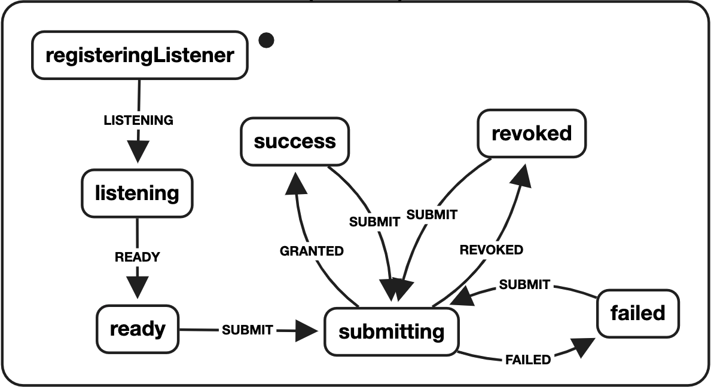

On this page you can find all components part of the public interface of the `@claimr/react-native-client` package.

## `ClaimrClient`

The `ClaimrClient` object maintains the connection with the API.

### `constructor(options)`: <`ClaimrClient`>

#### Parameters

- `options`: <`Object`>

  - `apiKey`: `string` (required)

  The API key to use when sending requests to the Unveiler API.
  You can get one at the [Unveiler Dashboard](https://dashboard.unveiler.io).

#### Returns

`ClaimrClient`

## `useLazyVerifiedLocation`

The `useLazyVerifiedLocation` hook is used to verify a user's location.
As it's lazy, the user needs to manually invoke it to send the request to the Unveiler API.
This can be done by calling the `submit` function once its defined by the hook.

The hook tracks its state using the following state machine:


The machine is initially in the `registeringListener` state, when it successfully registers the listener it will switch to the `listening` state.
Once enough raw GNSS data has been collected, it will move to `ready`.
In every state which has an outgoing edge with `submit` you can request the location to get verified.

> An iteractive version of the state machine can be explored [here](https://xstate.js.org/viz/?gist=2cccde93b8c36974fc5ebe6e4c147595).

#### Parameters

- `options`: <`Object`>
  - `client`: <`ClaimrClient`> Contains the API key used to make location verification requests.
  - `claim?`: <`Object`> The claim to be verified, if left empty, then it will default to collecting a claim for the user's current location, as determined by their reported GPS position.
    - `point`: <`PointClaim`>
      - `location`: <`{latitude: number, longitude: number}`> The coordinates of the point the user claims to be near at.
      - `radius`: <`number`> The distance in meters the user can be from `location` which would still allow their location verification request to pass.
  - `minEpochs?`: <`number`> The minimum amount of epochs of GNSS data to be collected before the location verification request can be send. Setting this to a higher value will require the user to wait longer before their location can be verified. Using a too low value will cause location verification requests to regularly fail as there would likely be too little data.
  - `maxEpochs`: <`number`> The maximum amount of epochs of GNSS data which will be send as part of the location verification request.

#### Returns

| Property   | Type                                               | Description                                                                                                                                                                                                                                                                                                                            |
| ---------- | -------------------------------------------------- | -------------------------------------------------------------------------------------------------------------------------------------------------------------------------------------------------------------------------------------------------------------------------------------------------------------------------------------- |
| `state`    | `States`                                           | The current state of this location verification hook.                                                                                                                                                                                                                                                                                  |
| `submit`   | `() => void` \| `undefined`                        | Callback to submit the location verification request to the Unveiler API. It will be `undefined` until sufficient raw GNSS data has been collected.                                                                                                                                                                                    |
| `claim`    |  `PointClaim` \| `undefined`                       | Contains the validated location results from the Unveiler API. Only available after `submit` has been invoked and the location was in fact successfully validated.                                                                                                                                                                     |
| `jwt`      | `string` \| `undefined`                            | Similar to `claim`, however now stored as a cryptographically secured JSON Web Token (JWT).                                                                                                                                                                                                                                            |
| `message`  | `string` \| `undefined`                            | An optional message returned from the Unveiler API. Only used to retrieve the error message.                                                                                                                                                                                                                                           |
| `progress` | `{current: number, target: number}` \| `undefined` | An optional progress indicator where `target` is the expected total amount of units of work until the next state change and `current` is the amount of units of work delivered. This value is currently only available for the `listening` state, where it reflects the amount of GNSS epochs collected before `minEpochs` is reached. |

## `VerifiedLocationProvider`

Gives one shared context for location verification purposes.
All its children will use the same location collection instance to verify the user's location, e.g. with `useLazyVerifiedLocation`.
Use this when registering multiple components or hooks which use the location based verification logic, or when you want to start collecting location data before the component or hook is rendered.

### Example

The example below shows how you can use the `VerifiedLocationProvider` to share the verified location collection proof between multiple `useLazyVerifiedLocation`-hook instances.

```jsx
import { Text } from 'react-native'
import { ClaimrClient, useLazyVerifiedLocation, VerifiedLocationProvider } from '@claimr/react-native-client'

const client = new ClaimrClient({ apiKey: 'MY_API_KEY' })

// Some child component which uses a verified location hook
const MyComponent = ({ name }) => {
  const { state } = useLazyVerifiedLocation({ client })

  return (
    <Text>
      {name}: {state}
    </Text>
  )
}

// Our main app component
const App = () => (
  <VerifiedLocationProvider>
    <MyComponent name={'Instance 1'} />
    <MyComponent name={'Instance 2'} />
  </VerifiedLocationProvider>
)
```
